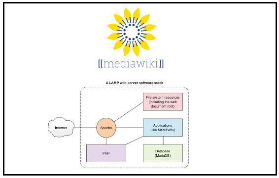

# MediaWiki-Deployment-Automation

                                            

Requirement:
------------
1. Database: Used mariadb
2. Apache: Used for Running the Mediawiki server 
3. PHP: For running mediawiki application and it should be (>= 5.5) 
4. Mediawiki: MediaWiki is a free and open-source wiki application written in PHP

Design
-------
  - Database as a service
  - Mediawiki as a service
  - Database docker image contians:                                                                                                                       
      a. mariadb-server and mysql                                                                                             
      Use: docker pull vmpuser/mariadb:latest      
  - mediawiki docker image contians :                                                                                                    
      a. apache 2.4.46 verison                                                                                                                 
      b. php: 7.3.7 version                                                                                                                 
      c. mediawiki: 1.33.0 version                                                                                                                 
      Use: docker pull vmpuser/mediawiki:latest       
      
      
Deployment
----------
  
 

CI/CD and Workflow
------------------
  - git push -> GitHub -> GitHub Action Trigger -> build Docker Images (App Image)
  - Pull App Image + MariaDB Image (from DockerHub) -> Deploy on K8s Cluster (minicube, leveraging service discovery)

 
This repository contains:
--------------------------- 
  1. Mediawiki docker image
  2. Mariadb docker image
  3. K8s manifest file for deployment
  4. Images

Deployment using K8s manifest:
------------------------------
    Kubectl apply -k ./k8s

How to access the service:
--------------------------
    access using: http://<service fqdn>:30163/
    
    ex: http://<service_name>.<namespace>.svc.cluster.local:30163
